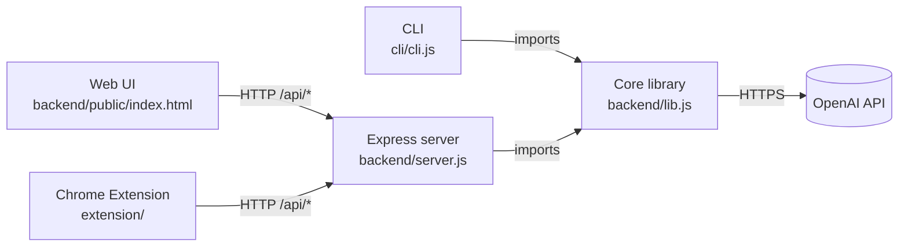

<p align="center">
  
</p>

<h1 align="center">COP-X — Prompt Optimizer</h1>

<p align="center">
  Cut LLM token cost by 90 %+ before the expensive call ever happens.<br/>
  CLI · Web dashboard · Chrome extension — all backed by one core library.
</p>

---

## Team — Green Lantern

- **Mahdi Ben Slima**
- **Zied Koubaa**
- **Amine Mseddi**
- **Hedi Moalla**

---

## What this is

LLMs are billed per token. In real use, two patterns waste most of that
budget: oversized one-shot prompts (a question buried in a wall of logs),
and long-running conversations that replay the whole history on every turn.

COP-X runs a cheap preprocessing model before the expensive call, so the
strong model only ever sees the *useful* part of the input. Two functions
expose this:

- **`shorten`** — compress a single verbose prompt into terse technical
  shorthand that produces the same answer.
- **`summarize`** — turn a long chat transcript into a structured
  *Bootstrap Summary* that lets you continue the conversation in a fresh
  chat without paying to replay history.

On the reference inputs in this repo, `shorten` removes **97.4 %** of the
tokens (5,144 → 132) and `summarize` removes **92.2 %** (4,768 → 370). Full
numbers and the underlying input/output files live in
[`cli/prompt examples/`](./cli/prompt%20examples) and [`cli/output/`](./cli/output).

→ Read more: [Problem statement](docs/PROBLEM.md) ·
[Technical abstract](docs/ABSTRACT.md) ·
[Use cases](docs/USE_CASES.md)

---

## Architecture in one diagram



→ Detailed walkthrough: [Architecture](docs/ARCHITECTURE.md)

---

## Three ways to use it

### 🖥️ CLI

Scriptable, file-based, pipeable.

```bash
$ node cli/cli.js shorten "./cli/prompt examples/prompts/prompt example.txt"

--- Prompt Compression ---
Original tokens: 5144
Processing...

Optimized Prompt:
-----------------
**Issue:** Endpoint not responding.

**Logs:**
1. **CV PDF Service**: Listening on `http://0.0.0.0:5005`, request to
   `/render` responded with `200`.
2. **Backend Service**: Started successfully, mapped routes.
3. **CORS Error**: `Not allowed by CORS` at `/app/dist/main.js:27:26`.
4. **Database Errors**: Multiple
   `ERROR: column cv_submissions.revision does not exist`.
-----------------
Optimized tokens: 132 (2.57%)
Optimization cost: $0.001162
```

→ [Getting Started — CLI](docs/getting-started/CLI.md)

### 🌐 Web UI

Single-page dashboard. Paste, click, copy.


→ [Getting Started — Web UI](docs/getting-started/WEB.md)

### 🧩 Chrome Extension (Promptify)

Inline inside ChatGPT. Live word counts, badge warnings, one-click
optimize, one-click "continue this in a new chat".


→ [Getting Started — Chrome Extension](docs/getting-started/EXTENSION.md)

---

## Quick setup (the short version)

```bash
# 1. Clone
git clone https://github.com/bsmahdi/COP-X-technical-project-submission.git
cd COP-X-technical-project-submission

# 2. Install
cd backend && npm install
cd ../cli && npm install

# 3. Configure
cd ../backend
cp .env.example .env
# edit .env and set OPENAI_API_KEY=sk-...

# 4. Pick your interface
node ../cli/cli.js shorten "../cli/prompt examples/prompts/prompt example.txt"   # CLI
npm start                                                                    # Web UI on :3000 (from backend/)
# Chrome extension: chrome://extensions → Load unpacked → extension/
```

Each interface has its own getting-started guide — links above.

---

## Documentation index

| Document | What's in it |
| --- | --- |
| [Problem](docs/PROBLEM.md) | Why this project exists |
| [Technical abstract](docs/ABSTRACT.md) | One-page summary — approach, implementation, results |
| [Architecture](docs/ARCHITECTURE.md) | Components, request lifecycle, file map, cost model |
| [Use cases](docs/USE_CASES.md) | When to use `shorten`, when to use `summarize` |
| [Getting Started — CLI](docs/getting-started/CLI.md) | Install, commands, flags, batch mode |
| [Getting Started — Web UI](docs/getting-started/WEB.md) | Run the server, walkthrough, API endpoints |
| [Getting Started — Chrome Extension](docs/getting-started/EXTENSION.md) | Load unpacked, popup features, troubleshooting |

---

## Repository layout

```
.
├── backend/                  # Server and core logic
│   ├── lib.js                # Core: shorten / summarize / verify, cost helpers
│   ├── server.js             # Express server, /api/shorten, /api/summarize
│   ├── .env                  # Configuration
│   ├── package.json
│   └── public/               # Web UI (single page)
├── cli/                      # Command-line tools
│   ├── cli.js                # Commander-based CLI
│   ├── batch-processor.js    # Runs full pipeline over example corpus
│   ├── package.json
│   ├── prompt examples/      # Reference inputs
│   └── output/               # Batch processing results
├── extension/                # Chrome extension (Manifest V3)
│   ├── manifest.json
│   ├── background.js         # Service worker — toolbar badge
│   ├── dancing plants.gif    # Success animation
│   ├── content/              # ChatGPT content script
│   └── popup/                # UI for the extension
└── docs/                     # Documentation and examples
    ├── ABSTRACT.md
    ├── PROBLEM.md
    ├── ARCHITECTURE.md
    ├── USE_CASES.md
    ├── getting-started/      # Guides for CLI, Web, and Extension
    ├── screenshots/          # UI previews
    ├── examples/             # Raw ChatGPT HTML captures
    └── assets/               # Project logos

```

---

## License

ISC.
