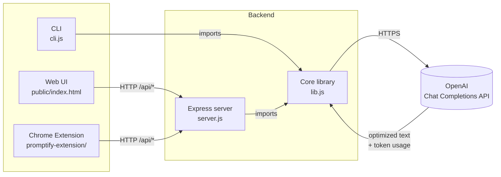
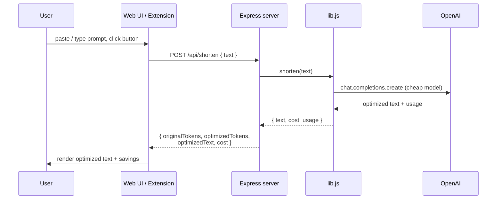
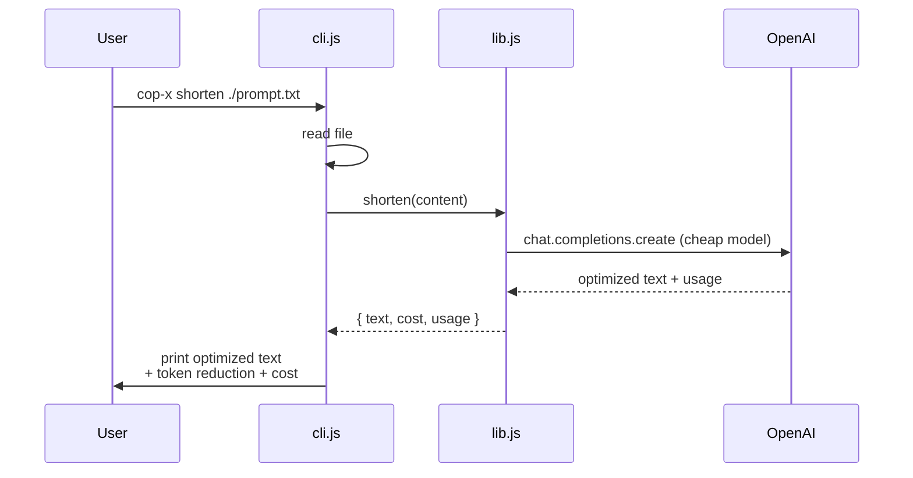

# Architecture

COP-X is built around a **single core library** with three independent
surfaces. Every surface ultimately talks to the same OpenAI endpoint, so
behavior stays identical regardless of how the user invokes it.

## Component overview

The CLI imports the library directly (no HTTP hop). The web UI and Chrome
extension both hit the Express server's `/api/shorten` and `/api/summarize`
endpoints, which internally call the same library functions.

## The two functions

Both functions live in [`lib.js`](../lib.js) and use the cheap model
(`CHEAP_MODEL`, default `gpt-4o-mini`) for the actual call.

### `shorten(text)`

Compresses a long, verbose prompt into the minimal instruction that still
produces the same downstream answer. The system prompt instructs the cheap
model to:

- strip greetings, repetition, and explanation,
- preserve specific values, error codes, and architectural details,
- emit terse technical shorthand.

### `summarize(text)`

Produces a structured *Bootstrap Summary* of a long conversation. Output is
constrained to five sections: the core problem, the current environment,
what has been tried, the exact next step, and any critical IDs. This format
is what allows a fresh chat to pick up where the previous one stopped without
replaying the whole history.

## Request lifecycle

### Web UI / Chrome extension path

### CLI path

## Cost model

Token estimation uses a rough `chars / 4` heuristic for fast UI feedback.
Real billing comes from `response.usage` returned by OpenAI, which is what
`lib.calculateCost()` uses to compute the actual dollar cost.

Default cost rates (per 1M tokens) are baked into [`lib.js`](../lib.js) and
can be overridden in `.env`:

| Variable                     | Default | Meaning                       |
| ---------------------------- | ------: | ----------------------------- |
| `CHEAP_INPUT_COST_PER_1M`    |   $0.15 | Cheap model input cost        |
| `CHEAP_OUTPUT_COST_PER_1M`   |   $0.60 | Cheap model output cost       |
| `EXPENSIVE_INPUT_COST_PER_1M`|   $2.50 | Strong model input cost       |
| `EXPENSIVE_OUTPUT_COST_PER_1M`|  $10.00 | Strong model output cost      |

## File map

| Path                                                   | Role                              |
| ------------------------------------------------------ | --------------------------------- |
| [`lib.js`](../lib.js)                                  | Core: shorten / summarize / verify, cost helpers |
| [`server.js`](../server.js)                            | Express server, exposes `/api/*` endpoints |
| [`cli.js`](../cli.js)                                  | Commander-based CLI               |
| [`batch-processor.js`](../batch-processor.js)          | Runs the full pipeline over `prompt examples/` |
| [`public/index.html`](../public/index.html)            | Web UI single-page app            |
| [`promptify-extension/manifest.json`](../promptify-extension/manifest.json) | Chrome extension manifest |
| [`promptify-extension/popup/`](../promptify-extension/popup) | Extension popup (HTML/CSS/JS) |
| [`promptify-extension/content/content.js`](../promptify-extension/content/content.js) | Content script — scrapes ChatGPT, replaces input |
| [`promptify-extension/background.js`](../promptify-extension/background.js) | Service worker — badge updates |
| [`prompt examples/`](../prompt%20examples)             | Reference inputs (prompts and conversations) |
| [`output/`](../output)                                 | Outputs from `npm run test-batch` |
